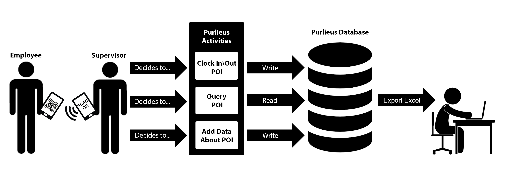

# Field Management System

The Field Management System (FMS), is an Android application that allows supervisors to keep track of their employee’s work hours. All data entry will be done onsite through a networked mobile device. The Field Management System is composed of three parts. The first part is an Android application that allows the supervisor to clock in employees via QR Code. The employee will carry a QR Code that the Android application will scan by using the camera on the mobile device. The second part will connect the Android application to a database hosted on Google’s Firebase. All employee data will be stored on the database and will only allow authenticated users to log into the Field Management System application. The last part will be connecting the Android Application to Google’s Sheets, where all employee hours will be stored. Google’s Sheets will allow easy access to all employee hours from any networked device. The objective is reducing the time it takes to log employee hours, eliminate the wait time before the company has access to the logged hours, and eliminating the need for a dedicated person to enter the logged hours. 

## Objectives

- Create a space where the supervisor has all the resources available to collect employee hours quickly and efficiently 
- Create a space where employee hours are immediately available to the company after data collection
- Create a space where data collection is secured
- Reduce time spent logging employee hours
- Eliminate the need to travel to the company and submit the logged hours 
- Eliminate the wait time before the company has access to the logged hours
- Eliminate conventional means to record employee work hours such as pencil and paper
- Eliminate the need for a data entry employee at the company to log hours into system

## Features

- QR Code Scanner
- QR Code Generator
- QR Code can be sent via text, email, or any android app that can send photos
- Realtime database
- Password reset via email link
- Employee timesheet is updated realtime
- Employee timesheet can be downloaded as an excel file
- The FMS application is secure because it requires user authentication via email link

## Demo Video
